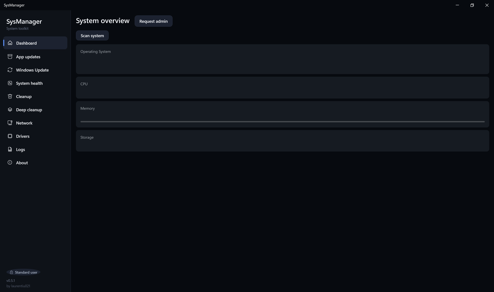
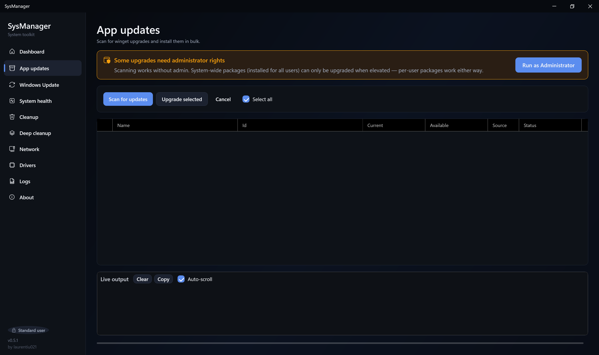
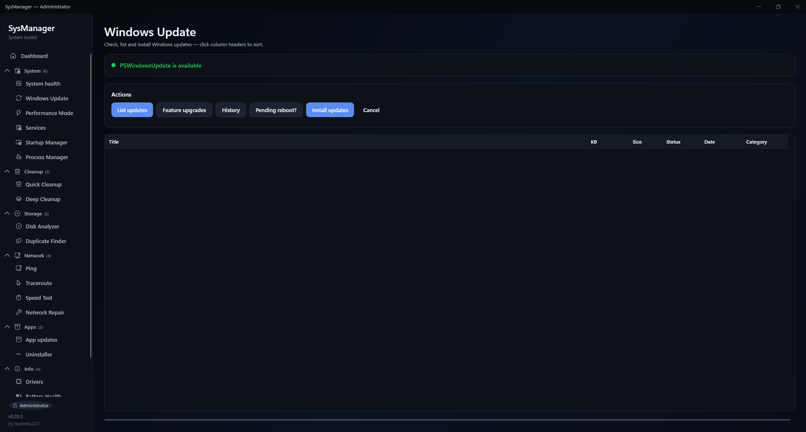
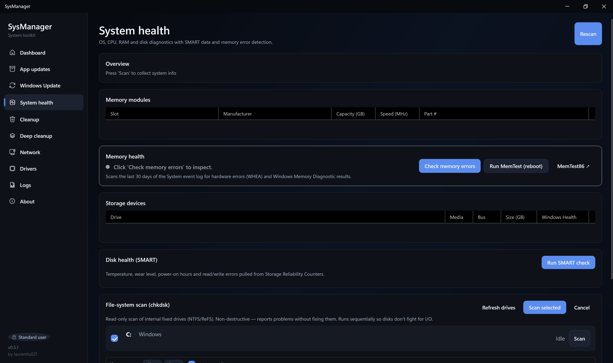
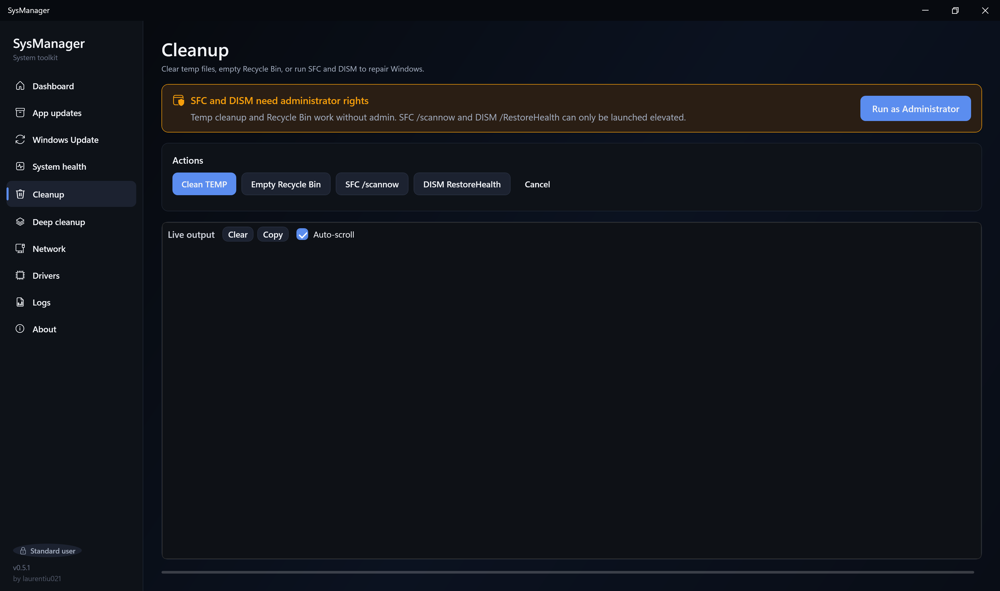
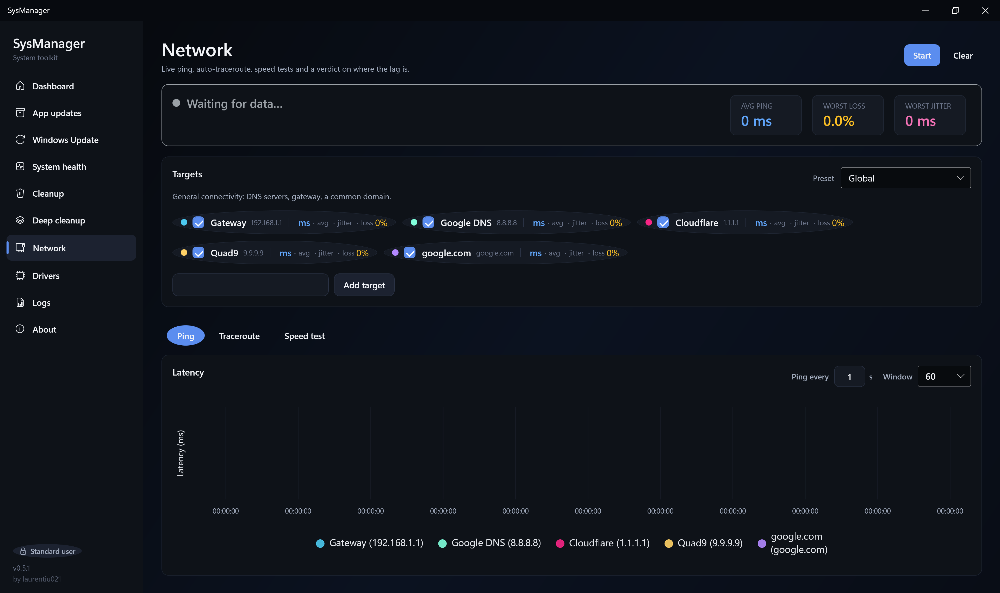
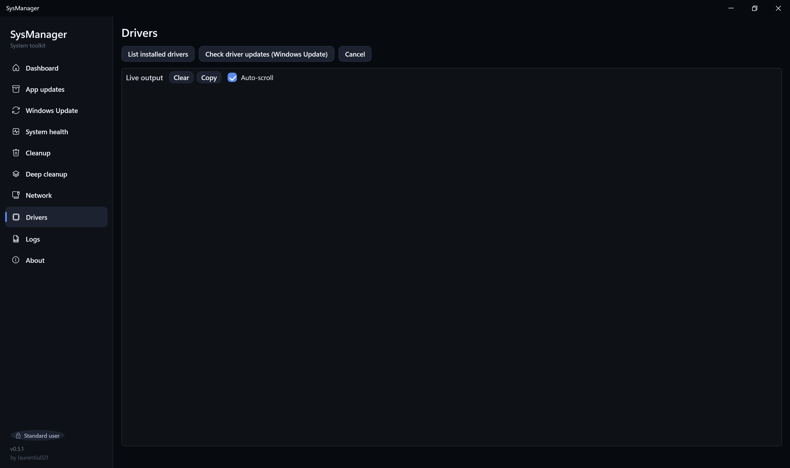
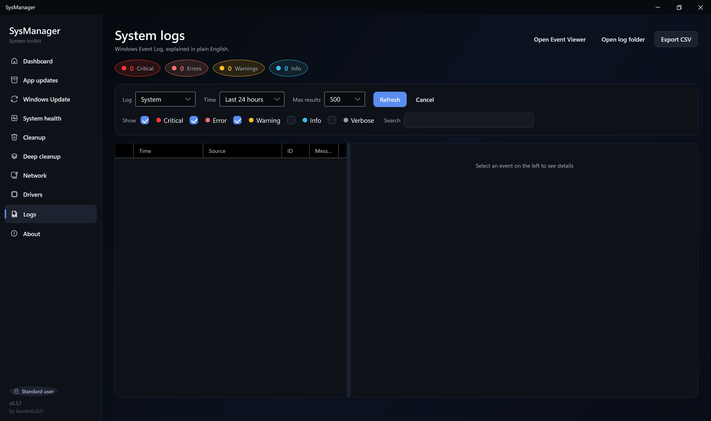
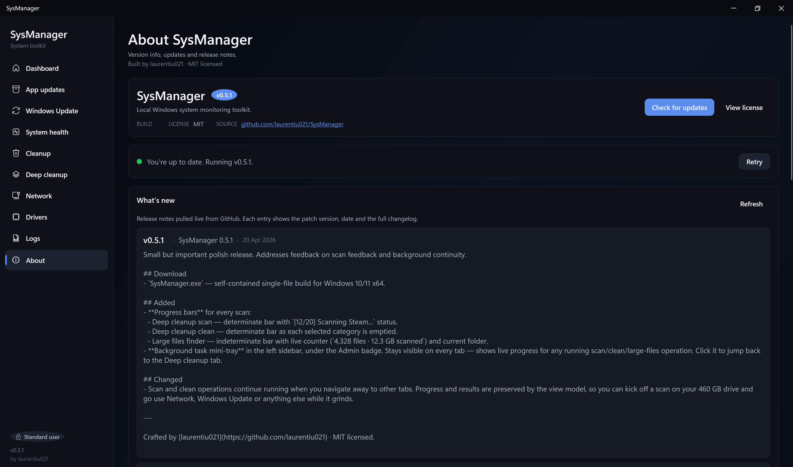

# SysManager

A modern Windows system monitoring toolkit: live network monitoring with
gamer-friendly presets, Windows updates, disk and memory health, gaming
launcher cache cleanup, app updates via winget, and a friendly Event Log
viewer — all in one WPF desktop app.

[](https://github.com/laurentiu021/SysManager/actions/workflows/ci.yml)
[](https://github.com/laurentiu021/SysManager/releases/latest)
[](https://github.com/laurentiu021/SysManager/releases)
[](https://github.com/laurentiu021/SysManager/issues)


[](LICENSE)

---

## What it is

SysManager is a local-first desktop tool for keeping an eye on a Windows PC.
It rolls network diagnostics, system health, Windows Update, app updates,
driver inventory, safe deep cleanup, and a readable Event Log viewer into a
single tabbed WPF app.

Everything runs on the machine itself. No cloud, no telemetry, no account.

Built with gamers in mind — live ping overlays for CS2, PUBG and streaming
endpoints, Steam/Epic/Battle.net/Riot/GOG/EA launcher cache cleanup, and
an honest "is it my PC, my ISP, or the server?" verdict.

## Features

### Network monitor
- Live ping across multiple targets overlaid on a single latency chart
- Auto-verdict that tells you in plain English whether packet loss is local,
  at your ISP, or at the far-end service
- **Presets for gamers & streamers**:
  - Global (Google, Cloudflare, your router)
  - **CS2 Europe** — Valve Frankfurt, Vienna, Stockholm relays
  - **PUBG Europe** — Krafton EU matchmaking endpoints
  - **Streaming** — YouTube and Twitch ingest
- Auto-traceroute on a configurable interval (30 s – 10 min)
- Speed tests: HTTP (Cloudflare) and the official Ookla CLI (auto-downloaded)
- Jitter, loss %, and average ping per target rolled up into health pills

### System logs (Windows Event Log, friendly)
- Browse System, Application, Security, and Setup logs
- Each event gets a plain-English explanation and recommended next steps
- Filter by severity and time range, plus full-text search
- Export to CSV, with a "search online" link for unknown events

### System health
- OS / CPU / RAM / storage overview
- SMART data per disk: temperature, wear %, power-on hours, read/write errors
- Colour-coded verdict per drive
- Memory diagnostic that scans the last 30 days of WHEA events for RAM errors
- Schedule the Windows Memory Diagnostic at next boot, or jump to MemTest86
- Read-only chkdsk with auto-discovered NTFS/ReFS drives and multi-select

### Windows Update (via PSWindowsUpdate)
- Auto-check for the PSWindowsUpdate module on tab open, with a one-click
  install card if it's missing
- Check for standard and feature updates
- Install selected updates, list history, check pending-reboot state
- Admin banner with a one-click "Run as Administrator" relaunch

### App updates (winget)
- Scan for upgradable packages
- Select all or individual packages, bulk upgrade with per-package status

### Cleanup (fast)
- Clear TEMP folders
- Empty the Recycle Bin
- Run `SFC /scannow` and `DISM /RestoreHealth` in the background — keep
  using the app while they grind

### Deep cleanup (safe)
- **Scan-first**: every category is discovered with size + file count
  before a single byte is deleted. You pick what goes.
- **System buckets**: NVIDIA / AMD / Intel installer leftovers, Windows
  Update cache, Delivery Optimization cache, Windows Installer patch
  cache, TEMP, Prefetch, crash dumps, old CBS logs, DirectX shader cache,
  Recycle Bin on every drive.
- **Gamer buckets** — launcher *caches only*, never game files or logins:
  Steam (appcache, htmlcache, depotcache, shader cache), Epic Games
  Launcher, Battle.net, Riot / League of Legends, GOG Galaxy, EA Desktop.
- **Windows.old** is detected and flagged as irreversible, never selected
  by default.
- Safe by design: never touches browsers, passwords, the registry, active
  drivers, or actual game files. Locked files are skipped, never forced.

### Large files finder
- Scan Downloads, Documents, Desktop, Videos, Pictures, Music, Program
  Files, or a whole drive.
- Configurable min-size (default 500 MB) and top-N (default 100).
- **Read-only** — only "Show in Explorer" and "Copy path" actions. Deletion
  is disabled by design so a mis-click can never hurt anything.

### Drivers
- List all installed drivers with versions and dates
- Check Windows Update for driver updates

### Dashboard
- One-line OS / CPU / RAM / disk summary
- Live uptime counter

### Updates (for SysManager itself)
- Auto-check on startup against the GitHub Releases API, plus a manual
  "Check for updates" button in the About tab.
- Discreet banner in the main window when a newer version is available.
- Background download of the new build with a progress bar. If the
  download is blocked, a "Manual download" button opens GitHub in the
  browser.
- One-click "Install" launches the new build and hands off cleanly.
- Full release-note history pulled live from GitHub.

## Screenshots

> Screenshots live under [`docs/screenshots/`](docs/screenshots/). If you
> want to contribute updated ones, see
> [`docs/screenshots/README.md`](docs/screenshots/README.md) for the
> capture and privacy conventions.

### Dashboard


### App updates


### Windows Update


### System health


### Cleanup


### Deep cleanup


### Network


### Drivers


### Logs


### About



## Download

Grab `SysManager.exe` from the [latest release](https://github.com/laurentiu021/SysManager/releases/latest)
and double-click it. The executable is self-contained — no installer, no .NET
runtime required.

### Verifying the download

Each release ships a matching `SysManager.exe.sha256`. Verify before running:

```powershell
Get-FileHash .\SysManager.exe -Algorithm SHA256
# Compare the output to the contents of SysManager.exe.sha256.
```

The build is not currently code-signed, so Windows SmartScreen may warn on
first launch. Verifying the SHA256 matches the one on the release page is the
recommended mitigation — see [SECURITY.md](SECURITY.md) for details.

## Build from source

Prerequisites: Windows 10 or newer and the [.NET 8 SDK](https://dotnet.microsoft.com/download/dotnet/8.0).

```powershell
git clone https://github.com/laurentiu021/SysManager.git
cd SysManager
dotnet run --project SysManager/SysManager/SysManager.csproj
```

### Produce a single-file exe

From the repo root:

```powershell
.\publish.ps1
```

Or manually:

```powershell
dotnet publish SysManager/SysManager/SysManager.csproj `
  -c Release -r win-x64 --self-contained true `
  -p:PublishSingleFile=true -p:IncludeNativeLibrariesForSelfExtract=true `
  -o publish
```

The resulting `SysManager.exe` lands in `publish/` and runs standalone on any
Windows 10 / 11 x64 machine.

## First-time flow

1. Launch the app — it opens on the Dashboard.
2. Go to Network and press Start — live ping begins.
3. For anything in Windows Update, Cleanup (SFC/DISM), or system-wide App
   updates, click the yellow "Run as Administrator" banner when it appears.
   The app relaunches elevated.

## Documentation

- [ARCHITECTURE.md](ARCHITECTURE.md) — project structure and key design decisions
- [TESTING.md](TESTING.md) — how the test suite is organised and run
- [CHANGELOG.md](CHANGELOG.md) — release notes
- [CONTRIBUTING.md](CONTRIBUTING.md) — how to build, test, and open a PR
- [SUPPORT.md](SUPPORT.md) — where to ask questions and get help
- [SECURITY.md](SECURITY.md) — reporting vulnerabilities, security model
- [CODE_OF_CONDUCT.md](CODE_OF_CONDUCT.md) — community standards

## Reporting bugs and requesting features

Found something broken? Missing a feature you'd love to have?

- 🐛 **Bugs** — [open an issue](https://github.com/laurentiu021/SysManager/issues/new?template=bug_report.yml)
  using the bug report template.
- 💡 **Features** — [open an issue](https://github.com/laurentiu021/SysManager/issues/new?template=feature_request.yml)
  using the feature request template.
- 💬 **Questions and how-to's** — use
  [Discussions](https://github.com/laurentiu021/SysManager/discussions) instead
  of issues for anything open-ended.
- 🔒 **Security vulnerabilities** — please report privately via the
  [Security tab](https://github.com/laurentiu021/SysManager/security/advisories/new).
  See [SECURITY.md](SECURITY.md) for the full policy.

The **About** tab inside the app has a "Copy environment info" helper that
dumps your SysManager version, Windows version, and elevation state in a
format ready to paste into a bug report.

## Tech stack

- .NET 8 (WPF, C# 12)
- CommunityToolkit.Mvvm for MVVM plumbing
- ModernWpfUI for the modern title bar
- LiveCharts2 for the real-time latency chart
- Serilog for structured logging
- xUnit and FlaUI for unit, integration, and UI-automation tests

## Privacy

SysManager runs entirely on your machine. It does not phone home, does not
collect telemetry, and does not require an account. Network features only
contact the hosts you explicitly configure (ping targets, speed-test servers,
Windows Update / winget endpoints).

## Contributing

PRs welcome! Please read [CONTRIBUTING.md](CONTRIBUTING.md) for the build
setup, coding conventions, and pull-request workflow. New contributors are
expected to follow the [Code of Conduct](CODE_OF_CONDUCT.md).

## License

MIT — see [LICENSE](LICENSE).

Crafted by [laurentiu021](https://github.com/laurentiu021).
